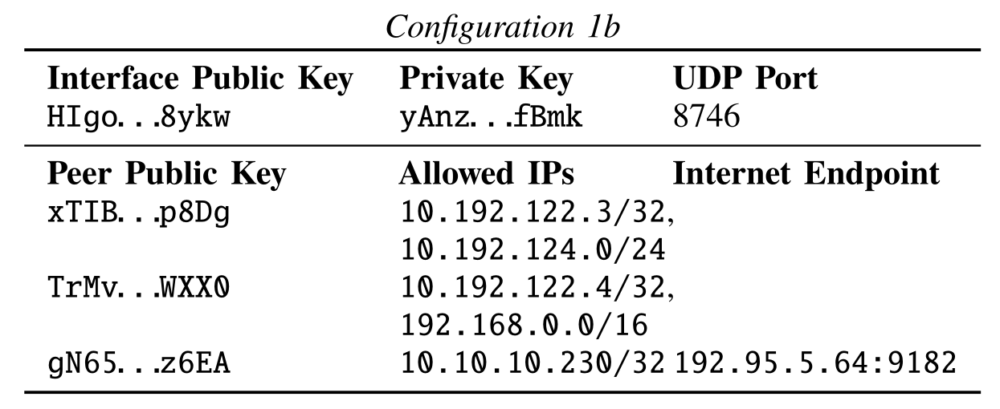
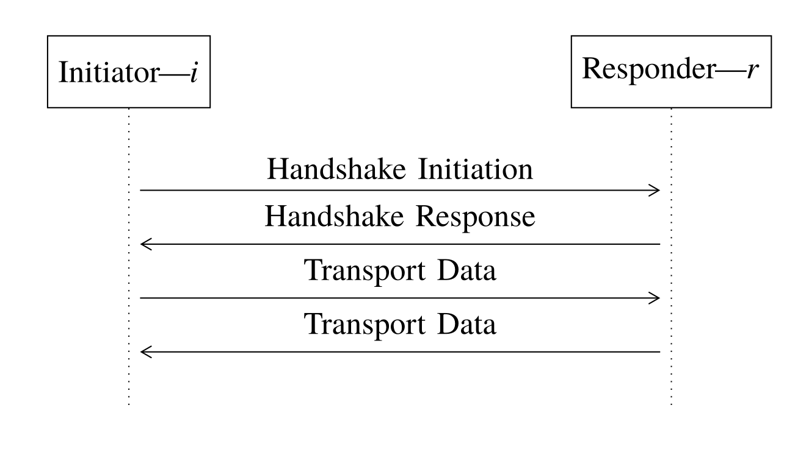

---
# try also 'default' to start simple
theme: seriph # penguin
# random image from a curated Unsplash collection by Anthony
# like them? see https://unsplash.com/collections/94734566/slidev
background: https://source.unsplash.com/collection/94734566/1920x1080
# apply any windi css classes to the current slide
class: 'text-center'
aspectRatio: '4/3'
# https://sli.dev/custom/highlighters.html
highlighter: shiki
# show line numbers in code blocks
lineNumbers: false
# some information about the slides, markdown enabled
info: |
  ## WireGuard: Next Generation Kernel Network Tunnel
  Presentation by FKY. Learn more at [Sli.dev](https://sli.dev)
# persist drawings in exports and build
drawings:
  persist: false
---

# WireGuard: Next Generation Kernel Network Tunnel

build perfection out of imperfection


<!-- <div class="abs-br m-6 flex gap-2">
  <button @click="$slidev.nav.openInEditor()" title="Open in Editor" class="text-xl icon-btn opacity-50 !border-none !hover:text-white">
    <carbon:edit />
  </button>
  <a href="https://github.com/slidevjs/slidev" target="_blank" alt="GitHub"
    class="text-xl icon-btn opacity-50 !border-none !hover:text-white">
    <carbon-logo-github />
  </a>
</div> -->

---
layout: two-cols
---

# TL;DR

<br />

WireGuard is a secure network tunnel, operating at layer 3, implemented as a kernel virtual network interface for Linux.

Being more secure, more performant, and easier to use.

::right::

```shell {all|1|2|3|4,9-10|all}
> ip link add dev wg0 type wireguard
> ip address add dev wg0 10.192.122.3/24
> ip route add 10.0.0.0/8 dev wg0
> ip address show
1: lo: <LOOPBACK> mtu 65536
inet 127.0.0.1/8 scope host lo
2: eth0: <BROADCAST> mtu 1500
inet 192.95.5.69/24 scope global eth0
3: wg0: <POINTOPOINT,NOARP> mtu 1420
inet 10.192.122.3/24 scope global wg0
```

```shell {all|1|2,9-11|12|13-15|all}
> wg setconf wg0 configuration-1.conf
> wg show wg0
interface: wg0
public key: HIgo...8ykw
private key: yAnz...fBmk
listening port: 8746
peer: TrMv...WXX0
allowed ips: 192.168.0.0/16, 10.192.122.4/32
peer: gN65...z6EA
allowed ips: 10.10.10.230/32
endpoint: 192.95.5.70:54421
> ip link set wg0 up
> ping 10.10.10.230
PING 10.10.10.230 56(84) bytes of data.
64 bytes: icmp_seq=1 ttl=49 time=0.01 ms
```


---
layout: center
---

# Motivation

---

# Motivation

##  IPsec

- Use Linux transform layer.
- **Users fill in a kernel structure** determining which ciphersuite and key, or other transforms such as compression, to use for which selector of packets traversing the subsystem. 
- **Separate layers of _key exchange_ from _transport encryption_.**

<br/>

### Problems: 

- **Too complicated** with much choice and malleability.
- **Hard to implement**.

---

# Motivation

## OpenVPN

- A **user space** TUN/TAP based solution that **uses TLS**.

<br/>

### Problems:

- **Very poor performance**
- **Not stateless**
- TLS stack is **too complex and being problematic** (CVE-2008-1673, CVE-2016-2053)

---

# WireGuard's Principles

- Simplicity and auditable codebase
- Extremely high-speed
- Solid engineering solution

---
layout: center
---

# Challenges & Solutions

---


# Complexity lead by layer Separation

<br/>

**do not separate.**

WireGuard simply gives **a virtual interface** — wg0 for example —
which can then be administered using the standard `ip` and
`ifconfig` utilities.

Key exchanges, connections, disconnections,
reconnections, discovery, and so forth **happen behind the
scenes transparently and reliably**, and the administrator does
not need to worry about these details.

from the perspective of administration, the WireGuard interface appears
to be **stateless**.

--- 

# How to do key distribution

> WireGuard says: "wrong layer to address that particular problem."

**Through a diverse set of out-of-band.**

Two WireGuard peers exchange their public keys
through some unspecified mechanism, and afterward 
they are able to communicate.

---

# Cryptographically Opinionated  

<br />

WireGuard is cryptographically opinionated. It intentionally lacks cipher and protocol agility.

- A variant of **Noise Protocol** for **1-RTT key exchange**
- **Curve25519** for ECDH
- **HKDF** for expansion of ECDH results
- **ChaCha20-Poly1305** for authenticated encryption
- **BLAKE2s** for hashing

---

# Cryptokey Routing

- Layer 3-only (As a IP tunnel).
- Peers (IP) are identified strictly by their public key (see Configuration 1a).


<style>
img {
    width: 80%;
    margin: auto;
}
</style>

---


<style>
img {
    width: 80%;
    margin: auto;
}
</style>


For example, if a packet is
decrypted from `xTIB...qp8D`, it will only be allowed if the
decrypted packet has a source IP of `10.192.122.3` or in the
range of `10.192.124.0` to `10.192.124.255`; otherwise it is
dropped.

---

# Endpoint & Roaming

<br/>
<br/>

- Optionally **pre-specify a known external IP address and UDP port** of that peer's endpoint.
- **Use the outer external source IP address for determining the endpoint.**

Note that the listen port of peers and the source port of
packets sent are always the same, adding much simplicity,
while also **ensuring reliable traversal behind NAT.**

---
layout: two-cols
---

# Endpoint & Roaming
An example

For example, the prior cryptokey routing table could be augmented
to have the initial endpoint of a peer (Configuration 2b):

Then, this host, `gN65...z6EA`, sends an encrypted packet
to `HIgo...f8yk` at `192.95.5.69:8746`. After `HIgo...f8yk` re-
ceives a packet, it updates its table to learn that the endpoint
for sending reply packets is, for example, `192.95.5.64:9182` (Configuration 1b).

<br />
<br />
<br />

> Note that the listen port of peers and the source port of
packets sent are always the same, adding much simplicity,
while also ensuring reliable traversal behind NAT.


::right::

<br/>
<br/>
<br/>
<br/>
<br/>


<br/>



---

# Send/Receive Flow

<br />
<br />
<br />

1) The plaintext packet reaches the WireGuard interface.
2) The destination IP address of the packet is checked.
3) Encrypt the plaintext packet.
4) Prepend a header with various field.
5) This header and encrypted packet, together, are **sent as a
UDP packet** to the Internet UDP/IP endpoint.
---

# Post-Quantum Cryptography

<br />
<br />
<br />

WireGuard provide a **optional pre-shared symmetric key mode**.

---
layout: two-cols
---

# Mitigate Denial-of-Service Attack in AKE

- **1-RTT key exchange handshake**
- **Silence is a virtue**
  - **No state stored for unauthenticated packets, and with no response generated.**
  - It is possible to implement WireGuard in a way that requires **no dynamic memory allocation** at all.

<br />
<br />
<br />

> However, this property requires the very first message received by the responder to authenticate the initiator, which **opens up the responder to replay attack**.
 
::right::

<br />
<br />
<br />
<br />
<br />



<style>

li {
    font-size: 0.9em;
}
</style>

---

# Prevent Replay Attack in AKE

<br />
<br />
<br />
<br />

A 12-byte TAI64N **timestamp** is included, encrypted and
authenticated, in the first message.

<br />
<br />
<br />
<br />

> TAI64N is very convenient because it is big-endian, allowing comparisons between two 12-byte timestamps to be done using standard
`memcmp()`.

---
layout: two-cols
---

# Mitigate Denial-of-Service Attack in AKE
problems with curve25519

<br />


**Computing Curve25519 point multiplication is CPU intensive.**

<br />

If the **responder** (the recipient of a message) **is under load**, it **may** choose to **not process** a handshake message (either an initiation or a response handshake message), but instead to **respond with a cookie reply message, containing a cookie**.

::right::

<br />
<br />
<br />


---
layout: two-cols
---

# How Cookie Works

<br />

When the responder receives the message, if
it is under load, it may **choose whether or not to accept** and
process the message based on **whether or not there is a correct
MAC that uses the cookie as the key**.

This mechanism:
- Ties messages sent from an initiator to its IP address
- Giving proof of IP ownership
- Allowing for rate limiting using classical IP rate limiting algorithms

<br />
<br />
<br />

[RFC6347](https://datatracker.ietf.org/doc/html/rfc6347#section-4.2.1)

::right::

<br />
<br />


---

# But Still...
More vulnerability emerge

<br />
<br />

1. We **prefer to stay silent** by not sending any reply to unauthenticated messages; indiscriminately sending a cookie reply message when under load would break this property.
2. **The cookie should not be sent in clear text**, because a man-in-the-middle could use this to then send fraudulent messages that are processed.
3. **The initiator himself could be denial-of-service attacked** by being sent fraudulent cookies.

---

# Improved Cookie Technique
Solve problem #1 - prefer to stay silent

<br />
<br />

In order for the responder to remain
silent, even while under load, **all messages have a first MAC
(`msg.mac1`) that uses the responder’s public key and optionally
the PSK (Pre-shared Key)**.

Under load or not under load, this
first MAC (`msg.mac1`) always is required to be present and
valid.

<br />
<br />

> While the public key of the responder itself is not secret,
it is sufficiently secret within this attack model, in which the
goal is to ensure stealthiness of services, and so knowing the
responder’s public key is sufficient proof for already knowing
of its existence.

---

# Improved Cookie Technique
Solve problem #2 - plain-text-cookie

<br />
<br />

We **apply an AEAD to the cookie in transit**,
again using as a symmetric encryption key the responder’s
public key, optionally the PSK, and a random public salt. Again,
the mostly public values here are sufficient for our purposes
within the denial-of-service attack threat model.

---

# Improved Cookie Technique
Solve problem #3 - DoS to initiator

<br />
<br />

We use the “additional
data” field of the AEAD to encrypt the cookie in transit to
additionally authenticate the first MAC (`msg.mac1`) of the
initiating message that provoked a cookie reply message.

> In other words, we use the AD field to
bind cookie replies to initiation messages.

---

# Improved Cookie Technique
<br />

With these problems solved, we can then add the aforementioned **second MAC (`msg.mac2`)** using the securely transmitted
cookie as the MAC key. **When the responder is under load, it
will only accept messages that additionally have this second
MAC.**


<style>
img {
    width: 80%;
    margin: auto;
}
</style>

---

# Stateless UX & Timers
From the perspective of the user, WireGuard appears
stateless.

<br />
<br />
<br />


A simple timer state machine is owed to the fact that only a 1-RTT handshake is required

- Transport Message Limits
- Handshake Initiation Retransmission
- Passive Keepalive

---
layout: center
---

# Implementation & Performance

---

# Linux Kernel Implementation

Simple / Fast / No Allocation / Integrate Natively / Buildable as an External Kernel Module

<br />
<br />
<br />

- Less than 4,000 lines of code.
- Reducing cache misses: by waiting until all individual packets of a super packet have been encrypted and encapsulated.
- All packet transformations are done in-place.
- [Radix Trie](https://en.wikipedia.org/wiki/Radix_tree) is preferred as route table.

---

# Performance
Throughput


<style>
img {
    width: 80%;
    margin: auto;
}
</style>
---

# Performance
Ping Time


<style>
img {
    width: 80%;
    margin: auto;
}
</style>

---

# In Conclusion

<br />
<br />
<br />
<br />

- **Simplicity and auditable codebase** - combine key exchange and encryption
- **Extremely high-speed** - Linux kernel implement optimization
- **Solid engineering solution** - novel cryptographic, improved cookie mechanism

---
layout: end
---

Thanks!
